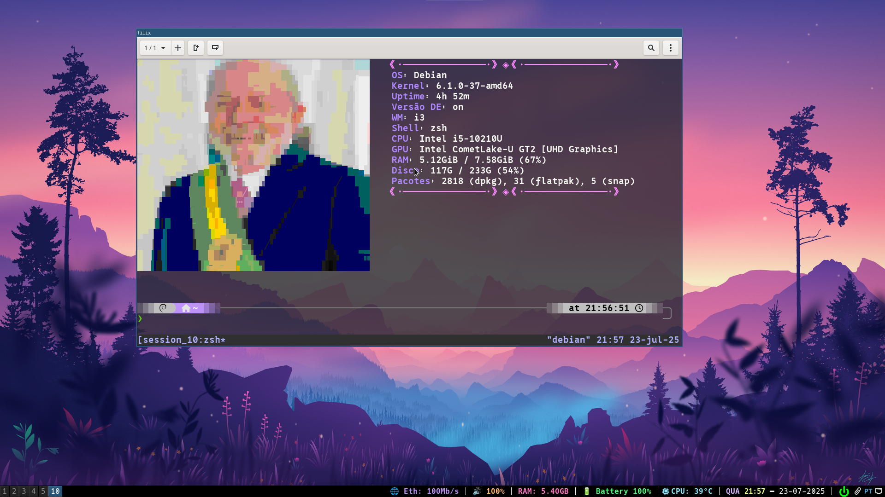
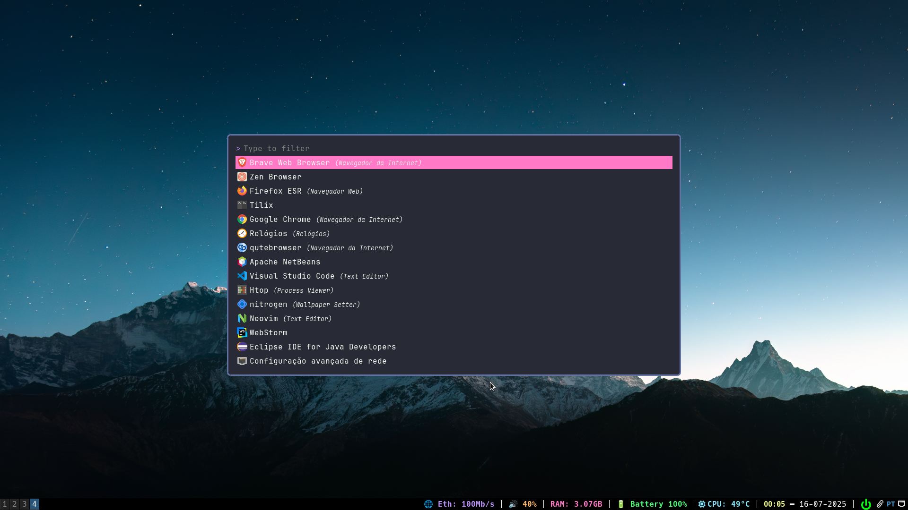
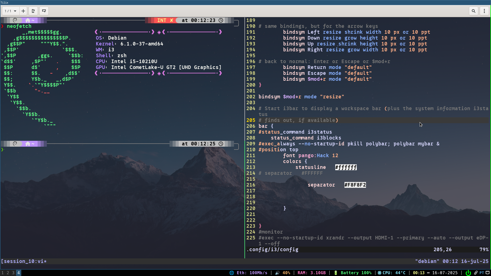
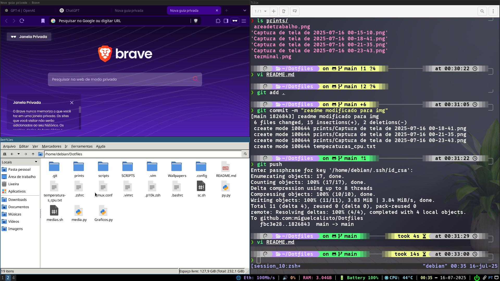
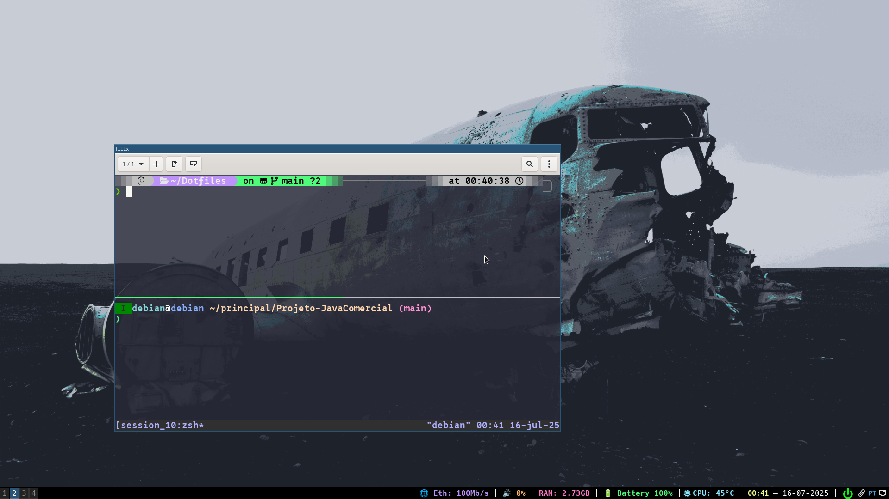
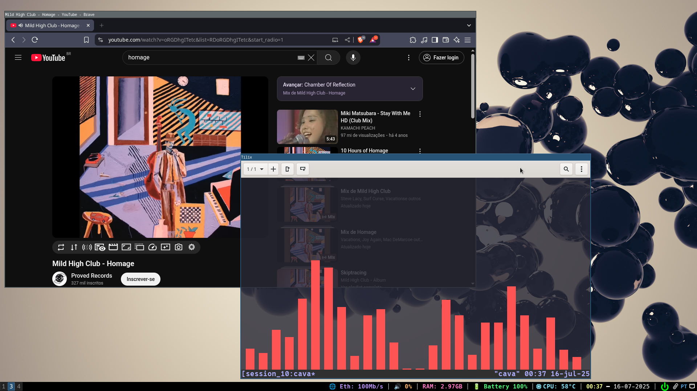
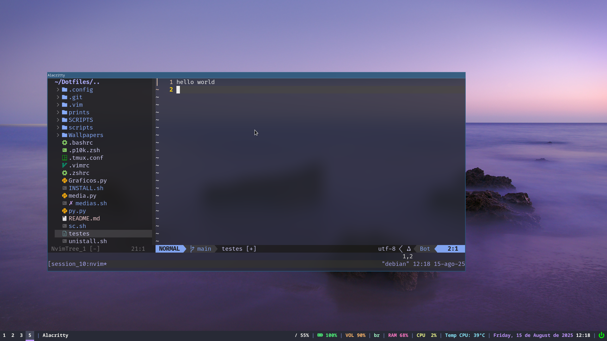

# Dotfiles para Debian 12 com i3wm, Rofi, Zsh, Vim , Neovim , i3blocks , Fish , Tmux .

Este repositório contém a minha configuração pessoal de **Dotfiles** para **Debian 12** com as seguintes ferramentas:
- **[i3wm](https://i3wm.org/)** (Gerenciador de janelas)
- **[Rofi](https://draculatheme.com/rofi)** (Lançador de aplicativos)
- **[Neofetch](https://github.com/dylanaraps/neofetch)** (Informações do sistema)
- **[Vim](https://www.vim.org/) / [Neovim](https://neovim.io/)** (Editores de texto)
- **[Zsh](https://ohmyz.sh/)** com **[Oh My Zsh](https://ohmyz.sh/)** e **[Fish](https://fishshell.com/)** (Shell)
- **[Tmux](https://github.com/tmux/tmux/wiki)** (Multiplexador de terminal)
- **[i3blocks](https://github.com/vivien/i3blocks)** (Barra de status para i3)
- **Script que Muda o Wallpaper Todo Dia** [Link para o repositório](https://github.com/miguelcalisto/Script-para-mudar-de-wallpaper-todo-dia.git)
- A maioria dos wallpapers são de:
- [GitHub - dharmx/walls](https://github.com/dharmx/walls/tree/main)
- [Unsplash](https://unsplash.com/)
- [Wallpapers.com](https://pt.wallpapers.com/)
- [Wallpaperflare](https://www.wallpaperflare.com/)
- [GitHub - Narmis-E/onedark-wallpapers](https://github.com/Narmis-E/onedark-wallpapers)
- [Wallhaven](https://wallhaven.cc/)
- **Fontes** [Nerd Fonts](https://www.nerdfonts.com/)
## Clonando

1. **Clonar o Repositório**

```bash
git clone https://github.com/miguelcalisto/Dotfiles.git 
```

## Instalando Dependências
```
sudo apt update -y
sudo apt install rofi neofetch vim neovim zsh fish tmux chafa i3blocks git diodon i3lock i3-wm pcmanfm tilix zsh fonts-firacode -y

```
## Utilizando o INSTALL.sh
**Isso vai gerar links simbolicos de Dotfiles para seus arquivos em .config**
```
sudo chmod +x INSTALL.sh
./INSTALL.sh
```
## Remover
**isso vai remover os links simbolicos do Dotfiles em .config**
````
sudo chmod +x unistall.sh
./unistall.sh
````
## Aviso - mudando o teclado para pt-br 
**Dependendo a distro o tipo do teclado pode não ser reconhecido!
````
setxkbmap -model abnt2 -layout br
echo 'exec --no-startup-id setxkbmap -model abnt2 -layout br' >> ~/.config/i3/config
````

## Capturas de Tela














